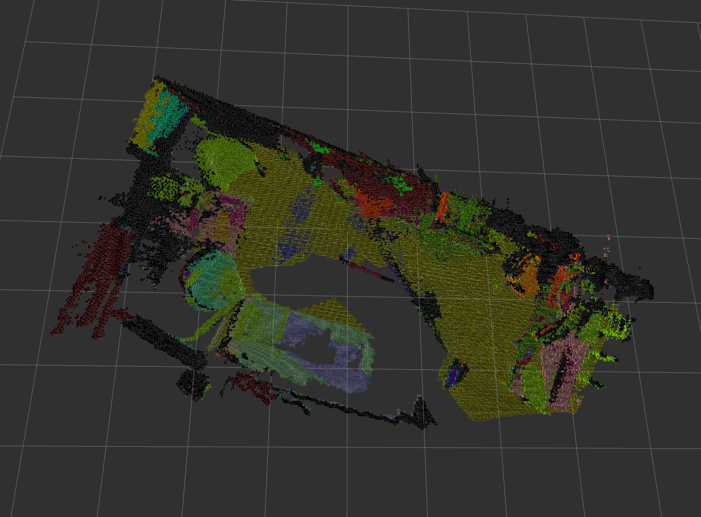

# Semantic SLAM
***Author:*** Xuan Zhang

Semantic SLAM can generate a 3D voxel based semantic map using only a hand holding RGB-D camera (e.g. Asus xtion) in real time. We use ORB_SLAM2 as SLAM backend, a CNN (PSPNet) to produce semantic prediction and fuse semantic information into a octomap. Note that our system can also be configured to generate rgb octomap without semantic information.



### Project Report:

Coming soon...

### Demo:

Coming soon...

# License

Semantic SLAM is released under a [MIT license](./LICENSE.txt) except for [ORB_SLAM2](https://github.com/raulmur/ORB_SLAM2) which is released under a [GPLv3 license](./ORB_SLAM2/License-gpl.txt).

# Dependencies

- Openni2_launch

```sh
sudo apt-get install ros-kinetic-openni2-launch
```

- ORB_SLAM2

We use [ORB_SLAM2](https://github.com/raulmur/ORB_SLAM2) as SLAM backend. Please refer to the official repo for installation dependency.

- Octomap

```sh
sudo apt-get install ros-kinetic-octomap
```

- Octomap rviz plugins

```sh
sudo apt-get install ros-kinetic-octomap-kinetic-plugins
```

- PyTorch 0.4.0

### Installation

After installing dependency for ORB_SLAM. You should first build the library.

```sh
cd orb_slam2
./build.sh
```

Then build the package.

```sh
cd <your_catkin_work_space>
catkin_make
```
